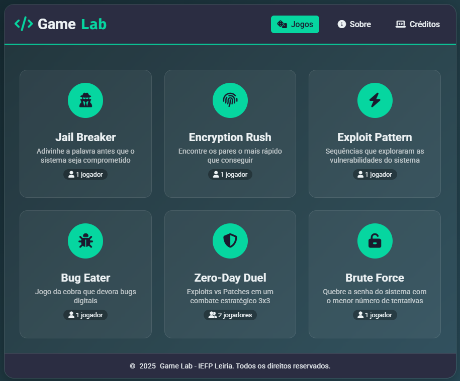
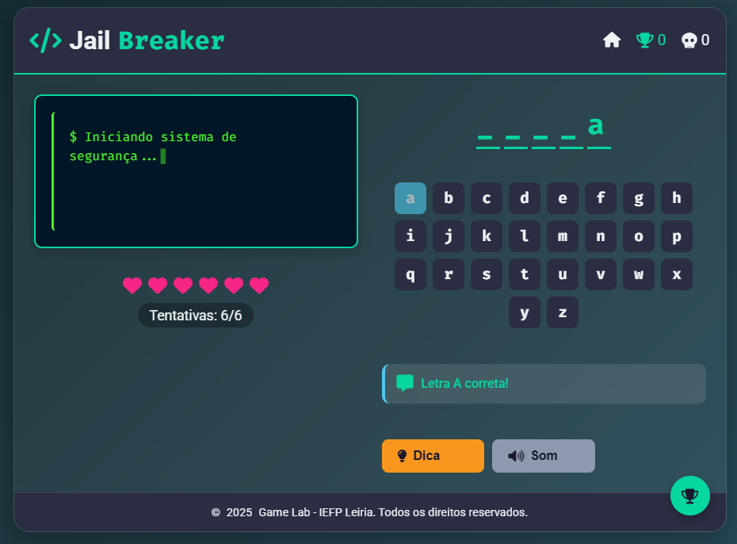
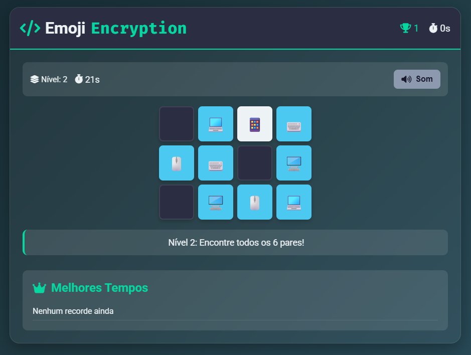
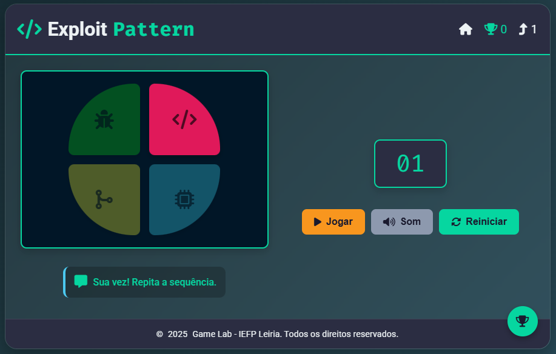
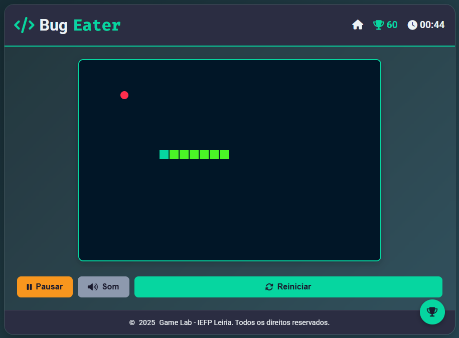
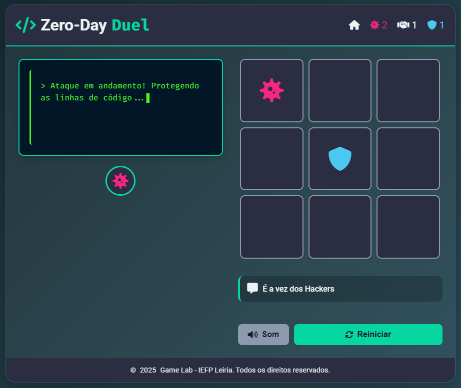
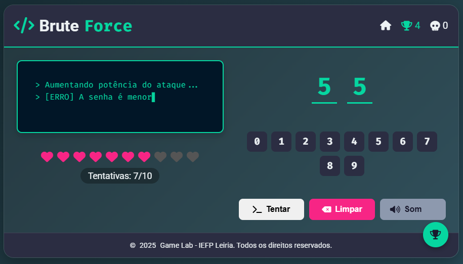

# 🎮 Game Lab


Este repositório reúne uma coleção de jogos interativos desenvolvidos pelos alunos do curso **Técnico Especialista de Gestão e Programação de Sistemas Informáticos** – 2º ano, apresentados no **16º Fórum Emprego e Formação** na **Feira de Leiria** 🎓✨

## 🎯 Objetivo

O objetivo principal deste projeto foi aplicar na prática os conhecimentos adquiridos ao longo da formação, através da criação de jogos educativos e envolventes utilizando **HTML**, **CSS** e **JavaScript**.  
Cada jogo simula um cenário relacionado à segurança, lógica ou raciocínio, e promove o aprendizado de forma divertida.

## 🧩 Jogos Desenvolvidos

### 🕵️ Jail Breaker


- Versão hacker do jogo da forca
- Adivinhe a palavra correta antes que o sistema seja comprometido
- Interface com terminal e comandos simulados

🔗 [Jogar Jail Breaker](https://babisobrinho.github.io/gamelab/jailbreaker.html)

---

### 🕒 Encryption Rush


- Jogo da memória com níveis progressivos
- Interface intuitiva e colorida
- Ranking local com os melhores tempos via **localStorage**

🔗 [Jogar Encryption Rush](https://babisobrinho.github.io/gamelab/encryptionrush.html)

---

### ⚡ Exploit Pattern


- Inspirado no clássico *Simon Says*
- Memorize e repita sequências de cores e sons
- Temática voltada à segurança digital

🔗 [Jogar Exploit Pattern](https://babisobrinho.github.io/gamelab/exploitpattern.html)

---

### 🐞 Bug Eater


- Inspirado no classico jogo da cobra
- Elimine todos os Bugs gerados
- Seja rapido para não acabar batendo nas paredes

🔗 [Jogar Bug Eater](https://babisobrinho.github.io/gamelab/bugeater.html)

---

### 🛡️ Zero-Day Duel


- Jogo do galo com tema de exploits e patches
- Estratégia em campo 3x3
- Hackers vs Devs

🔗 [Jogar Zero-Day Duel](https://babisobrinho.github.io/gamelab/zerodayduel.html)

---

### 🔐 Brute Force


- Descubra o número de dois dígitos com o menor número de tentativas
- Terminal interativo com dicas e feedback sonoro
- Design minimalista com atmosfera de invasão de sistema

🔗 [Jogar Brute Force](https://babisobrinho.github.io/gamelab/bruteforce.html)

## 📁 Estrutura do Projeto

```
gamelab/
├── css/                            # Estilos e design
│   ├── style-bugeater.css
│   ├── style-exploitpattern.css
│   ├── style-zerodayduel.css
│   └── style.css
├── js/                             # Jogos
│   ├── bruteforce.js
│   ├── bugeater.js
│   ├── encryptionrush.js
│   ├── exploitpattern.js
│   ├── footer.js                   # Footer dinâmico
│   ├── jailbreaker.js
│   └── zerodayduel.js
├── img/                            # Imagens para demos
│   ├── demo-bruteforce.png
│   ├── demo-bugeater.png
│   ├── demo-encryptionrush.png
│   ├── demo-exploitpattern.png
│   ├── favicon.svg                 # Ícone
│   ├── demo-jailbreaker.png
│   └── demo-zerodayduel.png
├── about.html                      # Sobre o projeto
├── bruteforce.html
├── bugeater.html
├── encryptionrush.html
├── exploitpattern.html
├── index.html                      # Lista de jogos
├── jailbreaker.html
├── README.md                       # Informações
├── team.html                       # Equipa responsável
└── zerodayduel.html
```

## 💡 Tecnologias Utilizadas

- **HTML5** – Estrutura semântica das páginas
- **CSS3** – Estilização com Flexbox, Grid e animações
- **JavaScript** (Vanilla) – Lógica dos jogos, manipulação DOM, interatividade
- **Font Awesome** – Ícones visuais
- **GitHub** – Controlo de versões
- **Local Storage** – Armazenamento de rankings localmente

## 👥 Equipa de Desenvolvimento

- [Juliana Alves](https://github.com/JulyDuds)
- [Babi Sobrinho](https://github.com/babisobrinho)
- [Lenice Soares](https://github.com/lenicesoaares)
- [Rebeca Santos](https://github.com/RebecaSantosb)
- [Aline Armando](https://github.com/kiamy6)
- [Thalyson Santos](https://github.com/taysoic)

## 📜 Licença

Este projeto é de caráter educativo e pode ser utilizado para fins não-comerciais.
Sinta-se livre para explorar, aprender e adaptar! 🚀

📚 IEFP Leiria
🛠️ Desenvolvido com dedicação, criatividade e paixão pela tecnologia! ❤️‍🔥
